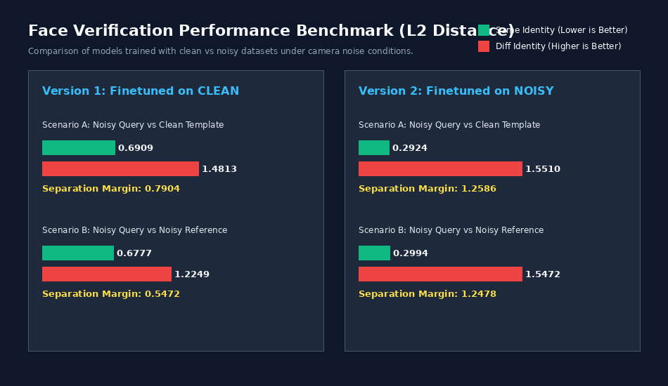

# Baseline FaceNet Recognition under Camera Low Light Noise

This repository implements a structured, modular PyTorch codebase for **Baseline FaceNet Recognition** and evaluates it under low light camera noise conditions, utilizing the original FaceNet backbone and standard Triplet Margin Loss.

It supports training and comparing two distinct model configurations:
1. **Version 1 (Clean)**: Finetuned on clean dataset, evaluated on noisy dataset.
2. **Version 2 (Noisy)**: Finetuned on noisy dataset (with simulated camera noise), evaluated on noisy dataset.



---

## 📂 Project Structure

```
secure_face_recognition/
├── configs/
│   └── config.yaml          # Hyperparameters, dataset paths, and training options
├── data/
│   ├── Dataset.csv          # File mapping image IDs to identity labels
│   └── Faces/Faces/         # Directory containing face JPG images
├── src/
│   ├── __init__.py
│   ├── model.py             # FacenetBaseline wrapper for InceptionResnetV1
│   ├── loss.py              # StandardTripletLoss wrapping nn.TripletMarginLoss
│   ├── dataset.py           # RealFaceTripletDataset image loader
│   ├── train.py             # Finetuning script supporting clean/noisy modes
│   └── inference.py         # Comprehensive evaluation over the entire dataset
├── tests/
│   └── test_model.py        # Unit tests using Python's standard unittest library
├── requirements.txt         # Package dependencies
└── README.md                # Project documentation
```

---

## 🛠️ Command Guide

### 1. Installation
Install the necessary python dependencies:
```bash
pip install -r requirements.txt
```

### 2. Running Unit Tests
Execute the unit test suite using python's built-in `unittest` module:
```bash
python -m unittest discover -s tests -p "test_*.py"
```

### 3. Training the Models

You can configure the training mode via `configs/config.yaml` using the `train_with_noise` flag:

* **To train Version 1 (Clean)**:
  Set `train_with_noise: false` in `configs/config.yaml` and run:
  ```bash
  python -m src.train
  ```
  The trained model weights will be saved to `models/facenet_clean.pth`.

* **To train Version 2 (Noisy)**:
  Set `train_with_noise: true` in `configs/config.yaml` and run:
  ```bash
  python -m src.train
  ```
  The trained model weights will be saved to `models/facenet_noisy.pth`.

### 4. Running the Comprehensive Evaluation Demo
Run the inference evaluation script to compare both Version 1 and Version 2 models on noisy images across the entire dataset:
```bash
python -m src.inference
```
This loads both models (falling back to the pre-trained backbone if saved weights are not found) and computes the average, minimum, maximum L2 distances, and separation margins for:
* **Noisy Query vs Clean Reference** (matching noisy face images against clean templates)
* **Noisy Query vs Noisy Reference** (matching noisy face images against other noisy images)

---

## 🧠 Loss & Evaluation Mechanism

1. **Standard Triplet Loss**: Minimizes the L2 distance between the anchor and positive embeddings while maximizing the L2 distance between the anchor and negative embeddings beyond a specified margin.
2. **Euclidean (L2) Distance**: Used as the distance metric to evaluate face similarity.
3. **Separation Margin**: Computed as `avg(Different Identity L2) - avg(Same Identity L2)`. A larger separation margin indicates stronger matching and verification performance under noisy conditions.
